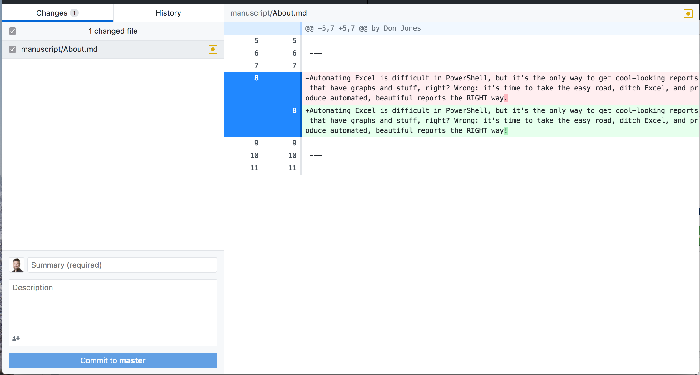

# General Instructions

Our books are hosted, in Markdown format, in http://GitHubs.com/devops-collective-inc. So, you'll need a way to **clone** our repositories, such as a GitHub desktop client.

Start in the book's [GitHub.com repo](http://github.com/devops-collective-inc), where you'll find a Fork button:

Clicking that will fork the repo into your own account in GitHub. When it's done, verify that you're now under your GitHub account (here, it's concentrateddon):

You an then clone the repo to your local computer, which will launch the GitHub Desktop Client.

Afterwards, the client won't show any files. That's normal - it only shows changes by default. You just open the local folder to see the files as they currently are.

Make whatever changes you plan to make. The GitHub client should show the changed files, along with the changes themselves.

You need to provide a short comment and description about what you've changed, and _commit_ your changes to the repo (alternately, you could right-click the changed file to discard your changes).

Your changes are still local, so you need to _push_ them up to your GitHub account.

With the changes safely in GitHub.com, you can log into the website and create a new Pull Request.

You'll need to confirm the PR.

Finally, you'll need to provide a description of what you've changed and finalize the PR. This submits it for review and merging into the main book!

 

However, it's important that you understand the unique structure of our books' files, because our publishing platforms need the correct structure in order to work properly.